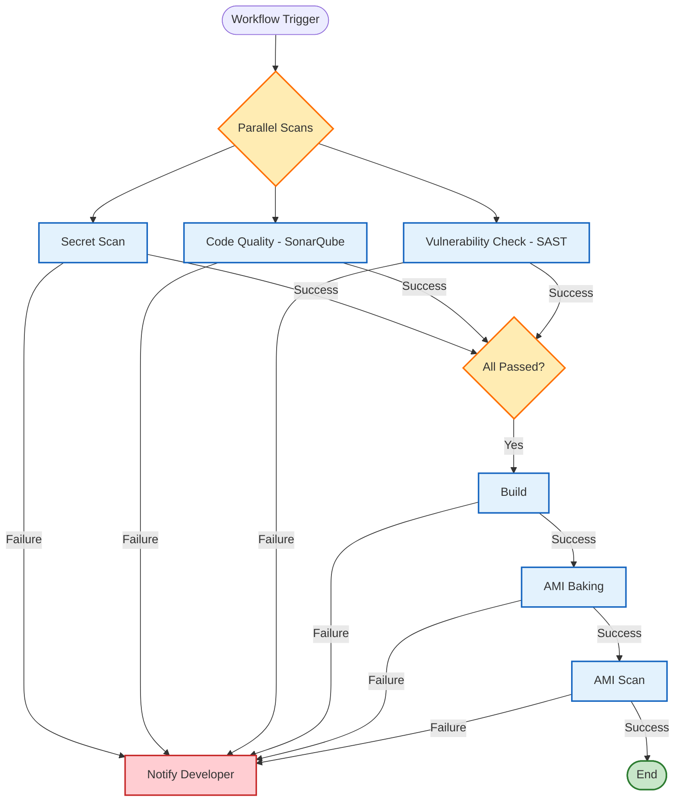

# bk-python-workflow

## Intention
The primary intention of this repository is to centralize and standardize the Continuous Integration (CI) workflows for Python projects within the BakeFoundry organization. By defining reusable workflows here, we ensure that all projects adhere to the same high standards for code quality and security without duplicating configuration files across multiple repositories.

## Context
This repository hosts the `all-ci.yml` reusable workflow. This workflow is designed to be called by other repositories to perform comprehensive checks on code changes.

Currently, the `all-ci.yml` workflow executes the following steps:

1.  **Parallel Security and Quality Checks**:
    -   **Secret Scanning**: Triggers [`bk-secret-scan-workflow`](https://github.com/BakeFoundry/bk-secret-scan-workflow) to detect sensitive information.
    -   **Code Quality Check**: Runs SonarQube analysis to ensure code maintainability and reliability.
    -   **Vulnerability Check**: Performs SAST (Static Application Security Testing) to identify security vulnerabilities.

    *If **any** of these checks fail, the developer is immediately notified.*

2.  **Build**:
    -   Compiles the application and runs unit tests.
    -   Executed only if all parallel checks pass.

3.  **AMI Release**:
    -   **AMI Baking**: Creates an immutable Amazon Machine Image (AMI) with the application artifacts.
    -   **AMI Scan**: Scans the baked AMI for vulnerabilities.
    -   Executed only after a successful build.

*Failure at any stage triggers a notification to the developer.*

## Pipeline Workflow

## How this helps Developers and Reviewers

### For Developers
- **Automated Security**: The formatting and security checks run automatically, catching issues early in the development cycle before code is even reviewed.
- **Consistency**: Developers don't need to worry about configuring their own CI pipelines; they can simply consume the standardized workflows.
- **Feedback Loop**: Immediate feedback on pull requests helps developers fix issues quickly.

### For Reviewers
- **Reduced Mental Load**: Reviewers can focus on the logic and architecture of the changes, knowing that style and security (like secret leaks) have already been verified by the automated system.
- **Confidence**: Seeing a green checkmark on the PR provides high confidence that the code meets the organization's baseline standards.
- **Standardization**: Enforces a consistent bar for quality across all projects.
